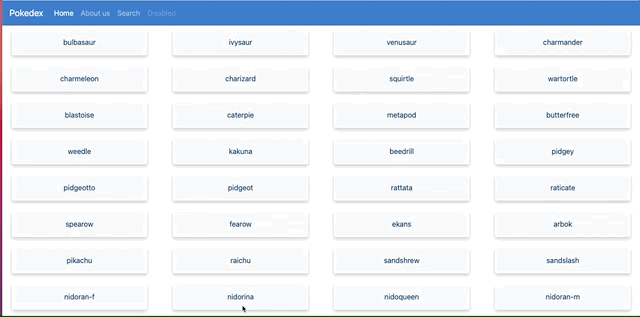

# POKEDEX

This application is a Pokemon Index built wiht HTML, CSS and JavaScript that loads data from an external API and enables viewing of data points in details to the user.

Users can find names, images, types and height of Pokemons of their choosing. The API used for this project is the [Pokémon API](https://pokeapi.co/).

**See the hosted application [here](https://tanimaraeliassantos.github.io/pokedexproject/).**

## Features

- Loads data from the Pokémon API
- Loads view of a list of items
- On user click, view opens with details for item clicked

## Technologies

- Bootstrap
- CSS
- HTML
- JavaScript

### Author

[Tanimara Elias Santos](https://github.com/anthropovixen)

### Version

1.0.0
